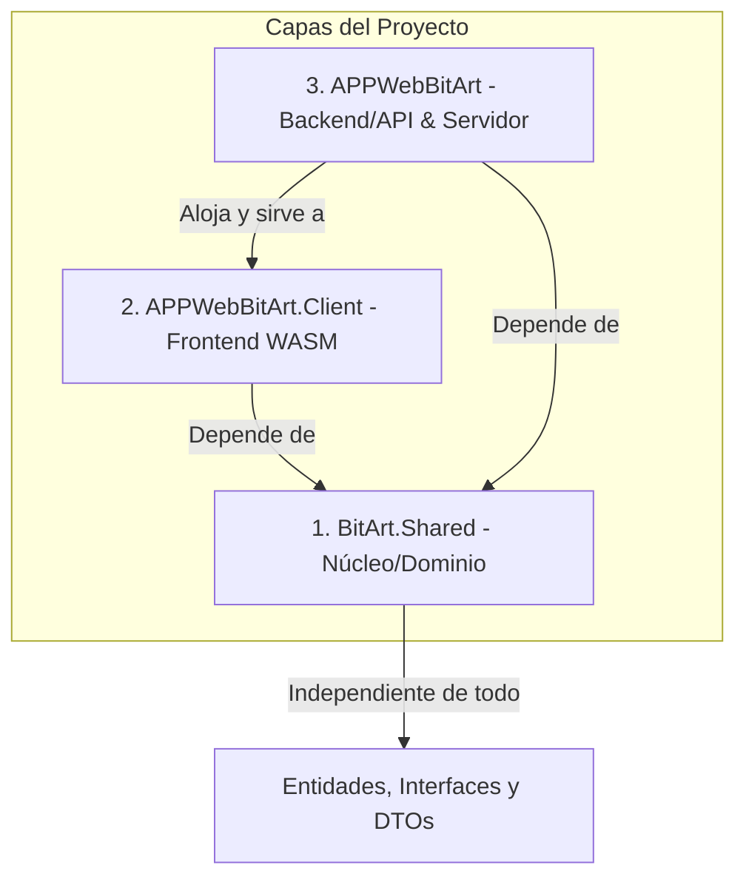
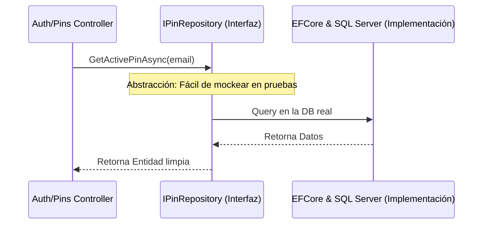
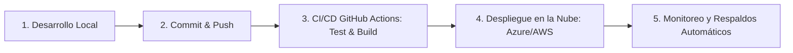

# 🏛️ Arquitectura y Patrones de Diseño - BITART CORE

Bienvenido a la guía maestra de arquitectura y patrones de diseño para el ecosistema **BitArt**. Este documento funciona como la base de conocimiento técnica (bóveda) para que tú, tu socia y cualquier futuro desarrollador puedan comprender, expandir y replicar el proyecto con estándares de calidad profesional listos para producción.

---

## 🎯 1. Filosofía de Arquitectura: Clean Architecture (Arquitectura Limpia)

Para asegurar que **BitArt Core** sea mantenible, escalable y altamente testeable a lo largo del tiempo, utilizamos los principios de la **Arquitectura Limpia**. La idea principal es la **independencia**: las reglas de negocio no deben depender de la base de datos, del frontend (interfaz de usuario) ni de frameworks externos.



### 📁 Estructura Física del Proyecto
La solución `.sln` está dividida en tres grandes proyectos:

1.  **`BitArt.Shared` (Núcleo / Core)**:
    *   **Propósito**: Contiene las entidades puras del negocio (`Project`, `Payment`, `AccessPin`) y los contratos/interfaces de servicios compartidos.
    *   **Regla de Oro**: Tiene cero dependencias externas. No sabe nada de SQL Server, ni de controladores, ni de pantallas de Blazor.
2.  **`APPWebBitArt.Client` (Presentación Cliente - Blazor WASM)**:
    *   **Propósito**: La interfaz interactiva del usuario que se ejecuta directamente en el navegador del cliente.
    *   **Tecnología**: Blazor WebAssembly (.NET 9).
    *   **Flujo**: Se comunica con el backend mediante peticiones HTTP asíncronas (`HttpClient`).
3.  **`APPWebBitArt` (Servidor / Host / Backend)**:
    *   **Propósito**: Centraliza el acceso a datos, la seguridad (JWT + Identity), la lógica de negocio pesada y expone endpoints mediante controladores Web API.
    *   **Tecnología**: ASP.NET Core API + Entity Framework Core 9.

---

## 🛠️ 2. Patrones de Diseño Implementados

Para resolver problemas comunes de desarrollo de software en producción, aplicamos patrones de diseño estándar de la industria.

### A. Patrón Repositorio (Repository Pattern)
**Problema**: Si los controladores de la API consultan directamente la base de datos con Entity Framework (`DbContext`), el código se vuelve difícil de probar (testear) porque requerirías una base de datos real activa para cada prueba unitaria.
**Solución**: Creamos una capa intermedia (Interfaz + Implementación) que abstrae la base de datos.



> [!TIP]
> **Beneficio de Testeo**: En tus pruebas unitarias con xUnit, puedes crear un "Falso Repositorio" (Mock) que devuelva datos fijos sin tocar SQL Server, permitiéndote testear la lógica del controlador en milisegundos.

### B. Inyección de Dependencias (Dependency Injection - IoC)
**Problema**: Crear instancias manualmente (`new MyService()`) dentro de las clases acopla fuertemente el código y rompe el principio de Responsabilidad Única.
**Solución**: El contenedor de inversión de control (IoC) de .NET 9 administra la creación y el ciclo de vida de los objetos de manera automática.

*Ejemplo en el Servidor (`Program.cs`)*:
```csharp
// Registramos el contexto de la base de datos
builder.Services.AddDbContext<ApplicationDbContext>(options =>
    options.UseSqlServer(connectionString));

// Registramos los repositorios (Interfaz e Implementación)
builder.Services.AddScoped<IPinRepository, PinRepository>();
```

### C. Patrón Data Transfer Object (DTO) y Mapper
**Problema**: Exponer tus entidades de base de datos directas al frontend es un riesgo de seguridad y acoplamiento (por ejemplo, exponer hashes de contraseñas o ids internos innecesarios).
**Solución**: Usamos DTOs (clases de transferencia de datos intermedias) y mapeadores.

```csharp
// Entidad de Base de Datos (en BitArt.Shared)
public class AccessPin 
{
    public int Id { get; set; }
    public string PinCode { get; set; } // Encriptado en producción
    public string Email { get; set; }
    public string TargetRole { get; set; }
    public DateTime ExpirationDate { get; set; }
}

// DTO para la API (en BitArt.Shared)
public class PinResponseDto 
{
    public string Email { get; set; }
    public string TargetRole { get; set; }
    public bool IsExpired => DateTime.UtcNow > ExpirationDate;
    public DateTime ExpirationDate { get; set; }
}
```

---

## 🔒 3. Seguridad de Nivel Producción

Para que una aplicación con clientes reales sea sostenible y segura, aplicamos las mejores prácticas en tres frentes:

### A. Autenticación y Autorización basada en Roles
*   Utilizamos **ASP.NET Core Identity** para el manejo interno de usuarios, credenciales y roles (`Administrador`, `Empleado`, `Cliente`).
*   Cuando un usuario inicia sesión, el backend genera un **JWT (JSON Web Token)** firmado digitalmente. Este token viaja en las cabeceras HTTP de cada petición del cliente para validar su identidad de forma segura y sin estado (stateless).

### B. Protección de Conexiones e Información Sensible
*   **ConnectionString Segura**: Las contraseñas e identificadores de base de datos se almacenan en variables de entorno o archivos secretos de desarrollo (`secrets.json`), **NUNCA** directamente en el repositorio de GitHub.
*   **Cifrado de Pines**: Los PINes de acceso temporal se encriptan con algoritmos de hashing fuertes (como SHA256) antes de guardarse en SQL Server.

---

## 🧪 4. Arquitectura de Pruebas Profesionales (Testing)

Una aplicación que no está probada no puede ir a producción de forma sostenible. Para BitArt, implementaremos tres niveles de testeo:

| Tipo de Test | Qué Prueba | Herramienta | Dónde se ejecuta |
| :--- | :--- | :--- | :--- |
| **Pruebas Unitarias (Unit Tests)** | Funciones individuales de negocio, lógica de vencimiento de pines y cálculos financieros. | `xUnit` + `Moq` | Local / Servidor de Integración (CI/CD) |
| **Pruebas de Componentes** | Comportamiento visual e interactivo de los componentes Blazor. | `bUnit` | Local |
| **Pruebas de Integración** | Conexiones reales entre Repositorio, Base de Datos en memoria y APIs. | `xUnit` + `EF Core InMemory` | Servidor de Integración (CI/CD) |

---

## 📈 5. Roadmap para Lanzamiento y Sostenibilidad

Para llevar BitArt al mercado real y poder replicarlo fácilmente para otros clientes, utilizaremos el siguiente flujo DevOps:



1.  **Automatización (CI/CD)**: Cada vez que hagas `git push dev-backend` o `dev-frontend`, un servidor automático correrá tus pruebas unitarias. Si una prueba falla, el despliegue se detiene, evitando que subas bugs a tus clientes.
2.  **Monitoreo**: Implementación de telemetría básica (como Application Insights) para recibir alertas inmediatas en tu celular si un cliente experimenta un error de carga o base de datos.
3.  **Respaldos**: Configuración automática de copias de seguridad diarias de SQL Server con retención de 30 días.

---

> [!NOTE]
> **Próximo Paso Práctico**: Crearemos un proyecto de pruebas unitarias (`BitArt.Tests`) en tu solución. Allí escribiremos tu primera prueba unitaria para validar que la lógica de generación y expiración de los `AccessPins` sea indestructible.
