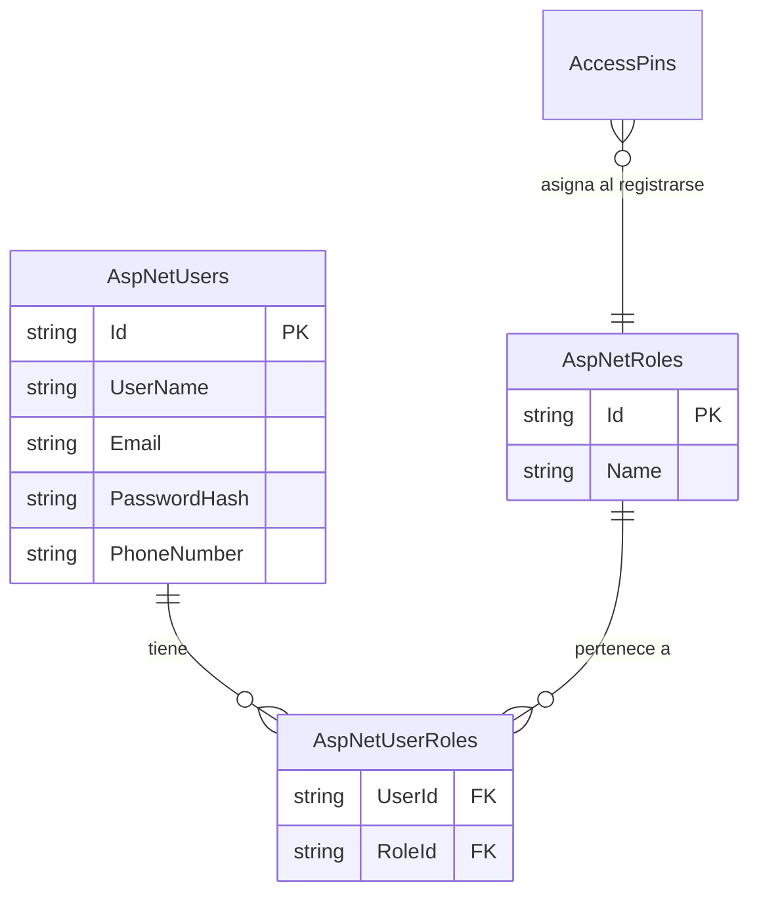

# 🗄️ Estructura de Base de Datos y Migraciones - BACKEND

Este documento detalla el diseño de la base de datos de **BitArt Core**, la configuración de Entity Framework Core, el soporte para ASP.NET Core Identity (Roles y Usuarios) y las instrucciones para manejar cambios en los modelos de datos.

---

## 📐 1. Esquema de Entidades de Negocio (BitArt Core)

La base de datos está diseñada con un enfoque **Code-First** (el código C# define las tablas). A continuación, se detalla la estructura lógica de las tablas de negocio:

### A. Tabla `AccessPins` (Control de Accesos)
Almacena los PINes generados temporalmente para permitir a los clientes o empleados registrarse de forma segura.
*   `Id` (int, PK): Identificador único.
*   `PinCode` (string): Código de acceso (hash SHA256).
*   `Email` (string): Correo del destinatario asignado.
*   `TargetRole` (string): Rol asignado (`Admin`, `Empleado` o `Cliente`).
*   `ExpirationDate` (DateTime): Fecha y hora límite de validez.

### B. Tabla `Projects` (Proyectos de BitArt)
Almacena los proyectos de diseño 3D, desarrollo o arte digital.
*   `Id` (int, PK): Identificador único.
*   `Name` (string): Nombre del proyecto.
*   `Description` (string): Detalles y alcance.
*   `Budget` (decimal 18,2): Presupuesto total.
*   `Status` (string): Estado (`Planificacion`, `En_Progreso`, `Revision`, `Completado`).

### C. Tabla `Payments` (Control de Pagos)
Registra las transacciones financieras y el estado de cobros de los proyectos.
*   `Id` (int, PK): Identificador único.
*   `ProjectId` (int, FK): Relación con la tabla `Projects`.
*   `Amount` (decimal 18,2): Monto del pago.
*   `PaymentDate` (DateTime): Fecha de la transacción.
*   `Status` (string): Estado (`Pendiente`, `Aprobado`, `Rechazado`).

---

## 🔐 2. Seguridad, Autenticación y Roles (ASP.NET Core Identity)

Para el manejo de usuarios y permisos en producción, **`ApplicationDbContext`** hereda de **`IdentityDbContext`**. Esto genera automáticamente en SQL Server las tablas de seguridad estándar de Microsoft para gestionar el inicio de sesión y la autorización por roles:



### A. Roles Sembrados en el Sistema (`SeedData.cs`)
Al arrancar la aplicación, el sistema autogenera los tres roles del negocio en la tabla `AspNetRoles`:
1.  **`Admin`**: Control total financiero, creación de clientes, proyectos y pines.
2.  **`Empleado`**: Diseñadores y desarrolladores. Acceso a portales de tareas y reuniones.
3.  **`Cliente`**: Acceso al visualizador de su proyecto, pasarela de pagos y agendamiento.

### B. El Flujo de Registro Seguro por Rol
1.  El Administrador genera un **`AccessPin`** indicando el correo y el `TargetRole` (ej. `Cliente`).
2.  El cliente recibe el pin y va a la pantalla de registro (`Register.razor`).
3.  Al registrarse, el backend valida el pin, crea el usuario en `AspNetUsers` y, mediante la tabla intermedia `AspNetUserRoles`, le asigna automáticamente el rol (`Cliente`) definido en el pin.

---

## 🛠️ 3. Guía de Comandos para Migraciones (EF Core 9)

Cuando hagas cambios en tus entidades de C# (dentro de `BitArt.Shared/Entities/` o `ApplicationDbContext`), debes seguir este procedimiento exacto para actualizar SQL Server:

> [!IMPORTANT]
> Los comandos de migraciones deben ejecutarse desde la terminal en la raíz del proyecto backend (`APPWebBitArt`).

### A. Crear una nueva migración:
Cuando añadas una columna o una nueva tabla en C#:
```bash
dotnet ef migrations add NombreDeLaMigracion --project APPWebBitArt --startup-project APPWebBitArt
```

### B. Aplicar los cambios a SQL Server:
Para actualizar tu base de datos local en SSMS:
```bash
dotnet ef database update --project APPWebBitArt --startup-project APPWebBitArt
```

### C. Revertir una migración (Si te equivocas):
Si creaste una migración local pero aún no has actualizado la DB y quieres borrarla:
```bash
dotnet ef migrations remove --project APPWebBitArt --startup-project APPWebBitArt
```
