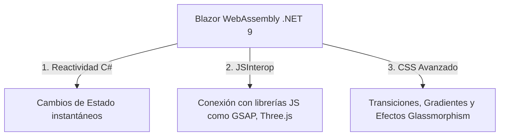

# 🎨 Landing Page Dinámica, Interactiva y Premium con Blazor

¡La respuesta corta es un rotundo **SÍ!** Con **Blazor WebAssembly (.NET 9)** podemos crear una Landing Page que no solo se vea dinámica, sino que se sienta **viva, interactiva, moderna y sumamente premium**, al nivel de las mejores páginas del mundo hechas en React o Next.js.

Esta guía detalla las herramientas, patrones y técnicas que utilizaremos para transformar la Landing Page de **BitArt** en una experiencia visual inolvidable.

---

## 🚀 1. ¿Cómo logra Blazor que una página sea dinámica?

A diferencia del HTML estático tradicional, Blazor ejecuta código de forma reactiva y en tiempo real sin recargar el navegador. Lo hace mediante tres pilares:



### A. Renderizado Interactivo (`InteractiveWebAssembly`)
Gracias a este modo en .NET 9, el navegador descarga la lógica en C# y responde de forma instantánea a las acciones del usuario (clicks, movimientos de mouse, ingreso de datos) en milisegundos, sin latencia del servidor.

### B. Interoperabilidad con JavaScript (JSInterop)
Para animaciones visuales muy complejas de scroll o efectos de partículas, Blazor puede comunicarse de forma transparente con librerías livianas de JS. Esto nos permite usar lo mejor del ecosistema visual de JavaScript mientras mantenemos todo nuestro control y lógica en C#.

---

## ✨ 2. Técnicas para que la Landing Page se vea "WOW"

Para lograr ese diseño premium que asombra a primera vista, implementaremos las siguientes técnicas visuales:

### A. Animaciones al hacer Scroll (AOS & GSAP)
*   **Qué hace**: A medida que el usuario baja en la página, los textos, imágenes y tarjetas de servicios no aparecen de golpe, sino que se "deslizan" suavemente hacia arriba, escalan o se desvanecen con efectos de difuminado.
*   **Cómo se hace**: Usamos una pequeña integración con la librería **GSAP** (GreenSock) o **AOS** (Animate On Scroll) que se activa dinámicamente desde el ciclo de vida de Blazor (`OnAfterRenderAsync`).

### B. Interactividad 3D con el Modelo del Robot (`.glb`)
*   **Qué hace**: El robot 3D de BitArt no tiene por qué ser una imagen estática. Podemos lograr que:
    *   Gire suavemente en 360 grados de forma automática.
    *   **Reaccione al cursor**: Que la cabeza del robot "siga" sutilmente el movimiento del mouse del usuario por la pantalla.
    *   Haga una animación de escala o rotación al hacer scroll.
*   **Cómo se hace**: Integramos el modelo `.glb` usando la librería **Three.js** o un visor declarativo como `<model-viewer>` integrado en un componente Razor de Blazor.

### C. Glassmorphism y Gradientes de Neón
*   **Qué hace**: Diseños con fondos semi-transparentes desenfocados (efecto vidrio esmerilado) combinados con gradientes dinámicos que se mueven de fondo.
*   **Efecto CSS**:
    ```css
    .glass-card {
        background: rgba(255, 255, 255, 0.05);
        backdrop-filter: blur(12px);
        -webkit-backdrop-filter: blur(12px);
        border: 1px solid rgba(255, 255, 255, 0.1);
        border-radius: 16px;
        transition: all 0.3s cubic-bezier(0.25, 0.8, 0.25, 1);
    }
    .glass-card:hover {
        transform: translateY(-5px);
        box-shadow: 0 10px 20px rgba(0, 242, 254, 0.2); /* Brillo de neón al pasar el mouse */
        border-color: rgba(0, 242, 254, 0.4);
    }
    ```

### D. Micro-Interacciones (La clave de lo Premium)
*   **Botones Líquidos / Neon**: Botones que brillan sutilmente al pasar el mouse o tienen animaciones de carga internas imperceptibles pero agradables.
*   **Efectos de Partículas**: Un fondo sutil de nodos conectados que flotan en el hero de la página (ideal para empresas de tecnología y diseño como BitArt).

---

## 📈 3. Plan de Acción Visual para BitArt
Cuando lleguemos al **Sprint 3 (UI & Experiencia)**, transformaremos la Landing Page con el siguiente orden:
1.  **Layout General**: Configurar la paleta de colores de BitArt en CSS (Negro profundo, cian neón y morado eléctrico).
2.  **3D Hero**: Colocar el Robot interactivo ocupando el 50% de la pantalla inicial en pantallas grandes, flotando suavemente.
3.  **Scroll Animations**: Agregar transiciones de desvanecimiento a las secciones de "Servicios" y "Acerca de Nosotros".
4.  **Contacto Interactivo**: Formulario dinámico en Blazor que valida los campos en tiempo real usando C# y muestra un check de éxito animado.
