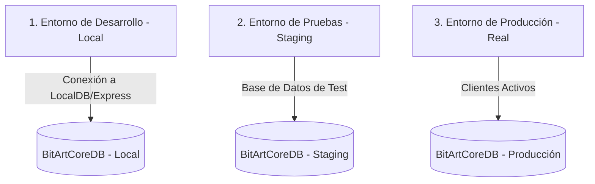
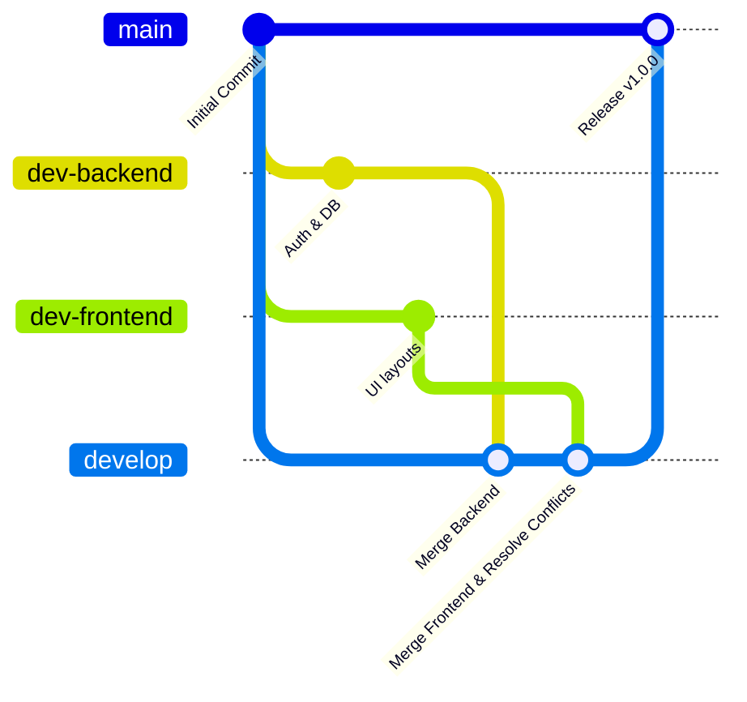

# 👥 Organización, Flujo DevOps y Gestión de Entornos - BITART CORE

Para que **BitArt Core** sea un proyecto profesional y sostenible en el tiempo, no basta con escribir buen código; necesitamos establecer un **marco de trabajo organizativo y técnico** claro. Esto garantizará que tú y tu socia trabajen sincronizadas, minimicen conflictos de código y puedan desplegar a producción con absoluta tranquilidad.

---

## 👔 1. Alineación Organizacional y Roles de Trabajo

Trabajar en pareja requiere delimitar responsabilidades claras dentro del desarrollo de este MVP.

### A. Definición de Roles del Proyecto
*   **Líder de Producto e Infraestructura (Tú)**:
    *   Responsable de la arquitectura del backend, la seguridad (JWT/Identity), el modelo de base de datos en SQL Server y la estrategia de calidad (Testing unitario).
    *   Guardiana de la Bóveda de Arquitectura y DevOps.
*   **Líder de UI/UX y Front (Tu Socia)**:
    *   Responsable del diseño interactivo en Blazor WASM, maquetación CSS, animaciones micro-interactivas, visualización 3D (`.glb`) y experiencia de usuario.

### B. Definición de "Terminado" (Definition of Done - DoD)
Para que una tarea se considere "lista" y pueda pasar del Backlog a Producción, debe cumplir estrictamente:
1.  **Compilación**: El código compila localmente en desarrollo sin advertencias críticas.
2.  **Pruebas**: Pasa el 100% de las pruebas unitarias y de integración locales.
3.  **Base de Datos**: Si hay cambios en los modelos de C#, se debe haber generado la migración de Entity Framework (`dotnet ef migrations add`).
4.  **Revisión Cruzada**: El código es revisado y aprobado por la otra socia (mediante un Pull Request).
5.  **Documentación**: Si es una nueva característica, se añade su explicación breve en esta Bóveda de Obsidian.

---

## 💻 2. Gestión de Entornos de Software

Un error típico en startups es programar y probar en la misma base de datos que usan los clientes reales. En **BitArt Core** manejaremos tres entornos completamente aislados:

### 🔐 Regla de Oro sobre Secretos y Credenciales:
> [!CAUTION]
> **NUNCA** guardes contraseñas, claves JWT o credenciales de base de datos dentro del código fuente o archivos que se suban a GitHub.
>
> *   En **Desarrollo**: Utiliza el Administrador de Secretos de .NET (`secrets.json`) que guarda los datos localmente en tu computadora de forma externa al repositorio.
> *   En **Producción**: Utiliza las Variables de Entorno del servidor web (Azure App Service, AWS o VPS).

---

## 🛠️ 3. El Flujo de Trabajo en Git (GitFlow Simplificado)

Para evitar que el código de backend y frontend se destruya mutuamente al subir cambios, el flujo de fusión debe ser el siguiente:

### Paso a Paso para cada Integración:
1.  **Trabajo Aislado**: Tú trabajas en `dev-backend` y tu socia en `dev-frontend`.
2.  **Pruebas Locales**: Cada una valida que su parte funciona por separado en su computadora.
3.  **Fusión en Develop**:
    *   Haces checkout a `develop`.
    *   Fucionas `dev-backend` (`git merge dev-backend`).
    *   Fusionas `dev-frontend` (`git merge dev-frontend`).
    *   **Aquí es donde se resuelven conflictos** (por ejemplo, si ambas modificaron `Program.cs` o `appsettings.json`).
4.  **Pruebas en Develop**: Se compila y se corren los tests sobre `develop`.
5.  **Paso a Main**: Una vez probado todo el flujo conjunto, se hace merge a `main` y se publica en producción.
