# 💰 Presupuesto, Estimación de Tiempos y Costos de Despliegue - BITART CORE

Para garantizar la viabilidad financiera de **BitArt**, debemos cuantificar tanto el **tiempo invertido** (valor del desarrollo de software) como los **costos operativos reales** de la infraestructura en la nube para el despliegue a producción.

---

## ⏱️ 1. Estimación de Horas del Backlog (MVP)

Basados en una planeación ágil para un MVP robusto de **324 horas totales**, distribuimos la carga de trabajo real a lo largo de los 5 Sprints:

```mermaid
gantt
    title Estimación de Esfuerzo (324h Totales)
    dateFormat  X
    axisFormat %d
    section Distribución de Horas
    Sprint 1: Base & Framework (47h)       :active, 0, 47
    Sprint 2: Core Loop & DB (39h)         : 47, 86
    Sprint 3: UI & Portales (108h)         : 86, 194
    Sprint 4: Pagos & QA (88h)             : 194, 282
    Sprint 5: Despliegue & Launch (42h)    : 282, 324
```

### 📊 Desglose de Carga por Áreas de Trabajo:
*   **Desarrollo Backend / Infraestructura (Tú)**: **164 horas** (Creación de base de datos, APIs, encriptación, seguridad JWT, lógica de negocio y tests unitarios).
*   **Arte, Diseño y Maquetación UI/UX (Tu Socia)**: **96 horas** (Estilos CSS, Blazor Client, componentes interactivos, visualización 3D y layouts responsivos).
*   **Gestión de Producto y Negocio (Socio / PM)**: **35 horas** (Definición de requerimientos, flujos de clientes y validación de historias de usuario).
*   **QA & Operaciones (DevOps)**: **29 horas** (Configuración de pipelines CI/CD, pruebas de integración, optimización de assets y despliegue final).

---

## 💵 2. Valorización Económica del Desarrollo (Costo de Oportunidad)

Aunque tú y tu socia inicien este desarrollo como "Sweat Equity" (inversión de su propio tiempo), es vital saber cuánto vale este software en el mercado real para calcular la rentabilidad del negocio o si en el futuro necesitan contratar apoyo.

Utilizaremos una tarifa estándar regional para desarrollo de software a medida (**$25 USD / hora** como tarifa base para desarrolladores de nivel intermedio):

| Rol | Horas Estimadas | Tarifa por Hora (USD) | Costo Total (USD) | Costo Equivalente (COP aprox.) |
| :--- | :--- | :--- | :--- | :--- |
| **Backend & Infraestructura** | 164h | $25 USD | $4,100 USD | ~$16,400,000 COP |
| **UI/UX & Frontend** | 96h | $25 USD | $2,400 USD | ~$9,600,000 COP |
| **Gestión de Producto / PM** | 35h | $20 USD | $700 USD | ~$2,800,000 COP |
| **QA & DevOps** | 29h | $30 USD | $870 USD | ~$3,480,000 COP |
| **TOTAL VALOR DE DESARROLLO**| **324h** | **-** | **$8,070 USD** | **~$32,280,000 COP** |

> [!NOTE]
> **Conclusión Financiera**: El software que están construyendo tiene un valor comercial de mercado de aproximadamente **$8,070 USD**. Este es el activo inicial con el que BitArt arranca como empresa.

---

## ☁️ 3. Presupuesto de Despliegue en la Nube (Hosting & Infraestructura)

Para lanzar el MVP con clientes reales, necesitamos alojar el Frontend (Blazor WASM), el Backend (Web API en .NET 9) y la Base de Datos (SQL Server). Presento dos alternativas adaptadas al presupuesto de una startup:

### 🚀 Opción A: Azure (Nube Corporativa - Altamente Recomendada para .NET)
Microsoft Azure ofrece la integración más limpia con .NET y SQL Server.

| Servicio | Nivel / Plan | Rol en BitArt Core | Costo Mensual (USD) |
| :--- | :--- | :--- | :--- |
| **Azure Static Web Apps** | Free Tier | Alojar el Frontend Blazor WASM | $0.00 USD |
| **Azure App Service (Linux)** | Basic B1 | Alojar la API Backend (.NET 9) | ~$13.00 USD |
| **Azure SQL Database** | Basic DTU (5 DTUs, 2GB) | Base de datos SQL Server productiva | ~$5.00 USD |
| **Dominio Personalizado** | Registro Anual (ej. `.com`) | Dirección web oficial (`bitart.com`) | ~$1.00 USD ($12/año) |
| **SendGrid / Resend** | Free Tier (100 emails/día) | Envío de correos de recuperación/pines | $0.00 USD |
| **TOTAL AZURE ESTIMADO** | **Nivel Inicial / MVP** | **Listo para primeros 100 clientes** | **~$19.00 USD / mes** (~76,000 COP) |

---

### 🐳 Opción B: VPS Económico (DigitalOcean / Hetzner - Máximo Ahorro)
Alojar todo dentro de un único servidor virtual privado (VPS) utilizando Docker.

| Servicio | Nivel / Plan | Rol en BitArt Core | Costo Mensual (USD) |
| :--- | :--- | :--- | :--- |
| **DigitalOcean Droplet** | Basic (2GB RAM, 1 CPU, 50GB SSD) | Aloja Frontend, API y SQL Server (en Docker) | $12.00 USD |
| **Dominio Personalizado** | Registro Anual | Dirección web oficial | ~$1.00 USD ($12/año) |
| **Certificado SSL** | Let's Encrypt (Free) | Seguridad HTTPS para las conexiones | $0.00 USD |
| **TOTAL VPS ESTIMADO** | **Mínimo Costo** | **Requiere mayor mantenimiento técnico** | **~$13.00 USD / mes** (~52,000 COP) |

---

## 📝 4. Presupuesto de Entrada Inicial para Lanzamiento

Para materializar el despliegue del MVP con total seguridad, te recomiendo contar con este fondo inicial:

1.  **Dominio oficial (`.com` o `.design`)**: **$12 USD** (pago anual).
2.  **Infraestructura de nube (Primeros 3 meses - Opción Azure)**: **$57 USD** ($19 USD/mes).
3.  **Fondo de Contingencia/Pruebas**: **$30 USD** (para cobros de pruebas de pasarelas u hosting adicional).
4.  **Presupuesto Inicial Total**: **$99 USD** (~400,000 COP).

> [!IMPORTANT]
> **Recomendación de la Maestra**: Te sugiero iniciar con la **Opción A (Azure)**. Aunque cuesta $6 USD más al mes que el VPS, te ahorra configurar servidores Linux manualmente y te permite escalar la base de datos con un clic cuando tengas tus primeros 5 clientes recurrentes.
