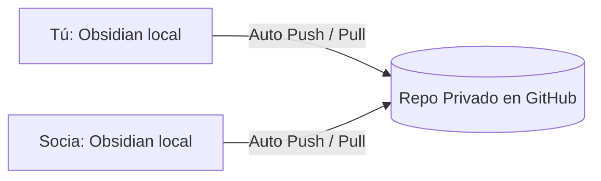

# 🤝 Guía de Colaboración: Cómo Compartir y Sincronizar esta Bóveda

Dado que una bóveda de Obsidian es simplemente una **carpeta local en tu computadora** con archivos Markdown (`.md`) e imágenes, es sumamente fácil compartirla y sincronizarla en tiempo real con tu socia. 

Como ambas son desarrolladoras de software, tienen acceso a las herramientas más potentes y profesionales de la industria. Aquí te presento las **3 mejores opciones** para sincronizar y colaborar en esta bóveda, ordenadas de la más recomendada a la más sencilla:

---

## 🚀 Opción 1: Git y GitHub + Plugin "Obsidian Git" (¡La más recomendada!)
Como programadoras, esta es la solución definitiva. Es **100% gratuita**, tiene control de versiones perfecto y evita que se borren información mutuamente.



### Cómo configurarlo paso a paso:
1.  **Crear un repositorio privado en GitHub** llamado `bitart-vault` (o similar).
2.  **Inicializar Git** dentro de esta carpeta `BITART CORE WEB INTERNA` y subirla a ese repositorio:
    ```bash
    git init
    git remote add origin URL_DE_TU_REPOSITORIO_NUEVO
    git add .
    git commit -m "feat: estructura inicial de la bóveda"
    git branch -M main
    git push -u origin main
    ```
3.  **Darle acceso a tu socia** al repositorio privado en GitHub. Ella debe clonarlo en su computadora y abrir la carpeta en su Obsidian.
4.  **Instalar el Plugin "Obsidian Git"** (en ambas computadoras):
    *   En Obsidian, ve a `Ajustes` > `Complementos de la comunidad` > `Explorar`.
    *   Busca **"Obsidian Git"** e instálalo.
    *   **Configuración mágica**: Configura el plugin para que haga `Autopull` cada 5 minutos y `Autocommit & Push` al cerrar Obsidian o cada 10 minutos.
    *   *Resultado*: Ambas escribirán notas en Obsidian y el plugin se encargará de subir y descargar los cambios en segundo plano de forma automática.

---

## ☁️ Opción 2: Almacenamiento en la Nube (Google Drive, OneDrive o Dropbox)
Es la alternativa más rápida de configurar si no quieren lidiar con ramas o commits para la documentación.

### Cómo configurarlo:
1.  **Crear una carpeta compartida** en Google Drive, OneDrive o Dropbox con el correo de tu socia.
2.  Ambas deben instalar la aplicación de escritorio de la nube (por ejemplo, **Google Drive para Escritorio** o **OneDrive**). Esto hace que la nube se comporte como una carpeta real en el disco local (ej. la unidad `G:` de Google Drive).
3.  Mueven esta carpeta `BITART CORE WEB INTERNA` dentro de la carpeta compartida en la nube.
4.  Ambas abren Obsidian, seleccionan **"Abrir carpeta como bóveda"** y buscan la carpeta dentro de su Google Drive/OneDrive local.
5.  *Resultado*: Los archivos se sincronizarán en tiempo real automáticamente cada vez que una guarde una nota.

> [!WARNING]
> **Conflictos de sincronización**: Si ambas editan la **misma nota al mismo tiempo en el mismo segundo**, la nube creará un archivo duplicado llamado *"Nota (Copia en conflicto)"* para no perder cambios de ninguna de las dos.

---

## 💎 Opción 3: Obsidian Sync (Nativo y Premium)
Es el servicio de sincronización oficial de los creadores de Obsidian.

*   **Costo**: Entre $4 y $8 USD al mes.
*   **Ventajas**: Cifrado de extremo a extremo, historial de versiones perfecto y es la única opción que funciona de forma impecable en dispositivos móviles (Android/iOS) sin configuraciones complejas.
*   **Cómo se usa**: Activas la suscripción en tu cuenta de Obsidian, creas una bóveda compartida e invitas al correo de tu socia.

---

### 📝 Recomendación de la Maestra:
Comiencen con la **Opción 1 (GitHub + Plugin Obsidian Git)**. Al ser ingenieras, les resultará muy natural, no les costará ni un solo centavo y les dará un control total de qué notas ha modificado cada una. Si alguna vez borran una nota por accidente, podrán recuperarla con un simple `git checkout`.
