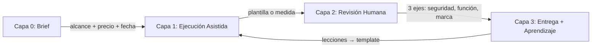

# 🏭 Workflow Operativo - BITART CORE

> [!IMPORTANT] Filosofía Central
> **"No construyas sistemas multiagente complejos. Automatización clásica primero, IA donde aporta de verdad, y el humano validando los procesos críticos (Human in the Loop)."**
>
> La IA genera rápido; el humano garantiza el estándar BitArt.

Este documento es el **manual de operación de la empresa**: cómo se recibe un cliente, cómo se ejecuta el trabajo y cómo se entrega con calidad. Cada proyecto debe atravesar estas 4 capas en orden, sin saltarse ninguna.

---

## 🔄 1. Las 4 Capas del Flujo de Trabajo



### Capa 0 — Brief (Humano, sin IA)
- Se define: qué se entrega, alcance, precio y fecha límite.
- **Regla dura de entrada:** el proyecto solo avanza si tiene alcance definido + plan de precio elegido + fecha límite acordada.
- Sin brief, no hay trabajo. Un brief incompleto es la causa #1 de sobrecostos.

### Capa 1 — Ejecución Asistida (IA + Plantillas)
- El trabajo se hace sobre **plantillas y componentes reutilizables**, con IA asistiendo (código, 3D, copy), nunca creando desde cero sin supervisión.
- **Regla dura:** si el trabajo no viene de una plantilla existente, se cotiza como desarrollo a medida (Plan 3). No se regala lo no estandarizado.

### Capa 2 — Revisión Humana por 3 Ejes (Criterio Senior)
- 🔒 **Seguridad:** ¿secretos fuera de Git? ¿endpoints autorizados? ¿datos del cliente protegidos?
- ⚙️ **Funcional:** ¿cumple el brief? ¿la base de datos migró correctamente? ¿los flujos se prueban de punta a punta?
- 🎨 **Marca:** ¿el resultado se ve y suena como BitArt?
- **Regla dura:** Nada se entrega sin aprobar los 3 ejes. En procesos críticos (pagos, datos, cuentas) la IA propone y el humano **aprueba**. Nunca IA supervisando IA.

### Capa 3 — Entrega + Aprendizaje
- Publicar, entregar y **devolver lo aprendido al template**: cada bug o lección de un proyecto se convierte en regla del template.
- Así cada proyecto nuevo nace mejor que el anterior. Ese es el verdadero "agente que mejora": la documentación y el template vivos.

---

## 🧊 2. Pipeline 3D (Meshy + Blender)

```
1. Brief visual (humano)
   └─ Referencias, estilo, polígonos objetivo, plataforma destino

2. Generación (Meshy - IA)
   └─ Text-to-3D o Image-to-3D → base model (OBJ/FBX/GLB)
   └─ Regla dura: el output de Meshy NUNCA va directo a producción

3. Pulido (Blender - el valor humano)
   └─ Retopología, UVs, materiales, rigging/animación

4. Exportación según destino (bifurcación)
   ├─ Web (Three.js): GLB + compresión Draco + LODs → model-viewer
   └─ Roblox (Lua):   FBX + escala/transform aplicada → Roblox Studio

5. Puerta de calidad (revisión humana)
   └─ ¿Rendimiento? ¿Coincide con el brief? ¿Se ve BitArt?
```

### Reglas por Plataforma
| Plataforma | Formato de Salida | Budget Objetivo | Cuidados |
|---|---|---|---|
| Web (Three.js) | GLB comprimido (Draco) | < 2-5 MB, con precarga | LODs, texturas optimizadas |
| Roblox | FBX → Roblox Studio | Conteo bajo de triángulos (móviles) | Sin materiales exóticos, escala aplicada |

> [!CAUTION] Regla de Oro 3D
> **Nunca entregues un mesh de Meshy sin pasar por Blender.** La base generada por IA tiene topología desordenada y exceso de polígonos. El estándar BitArt lo garantiza el pulido humano.

---

## 🗂️ 3. Mapa de Herramientas por Producto

| Producto | Proceso Crítico | Herramientas |
|---|---|---|
| Portales / CRMs | Facturación, datos de clientes | .NET 9 + Blazor + SQL Server + `BitArtCore Template` |
| Web 3D | Entrega visual, rendimiento web | Blender → GLB (Draco) → Three.js + **Meshy** para bases |
| Roblox | Monetización, cuentas | Roblox Lua + Studio + Blender → FBX + **Meshy** para assets |

---

## 🚦 4. Criterios de Paso (Resumen Ejecutivo)

1. **Brief completo** (alcance + precio + fecha) → recién ahí se ejecuta.
2. **Plantilla primero**: si no existe plantilla, es desarrollo a medida (Plan 3).
3. **Revisión humana obligatoria**: seguridad + función + marca.
4. **Human in the Loop** en procesos críticos: la IA propone, el humano aprueba.
5. **Cada entrega alimenta el template**: lección aprendida = regla del template.

---

## 🔗 Documentos Relacionados
- [[Gestion y Negocio/01_Organizacion_y_Flujo_DevOps|Organización y Flujo DevOps]]
- [[Gestion y Negocio/03_Presupuesto_y_Estimaciones|Presupuesto y Estimaciones]]
- [[BITART CORE MODELO DE NEGOCIO/4_Planes_y_Soluciones|Planes y Soluciones]]
- [[Arquitectura.NET/Frontend/01_Componentes_Blazor_y_Modelos3D|Componentes Blazor y Modelos 3D]]